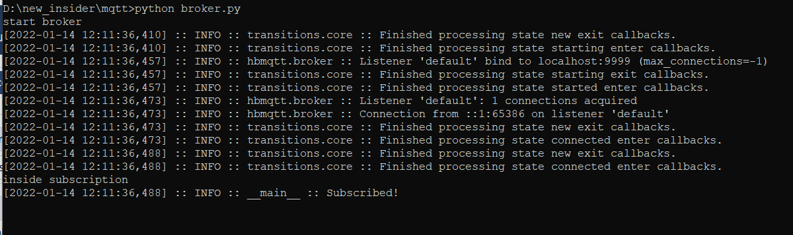
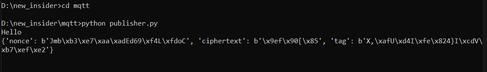
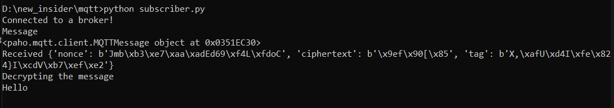
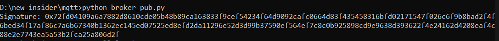
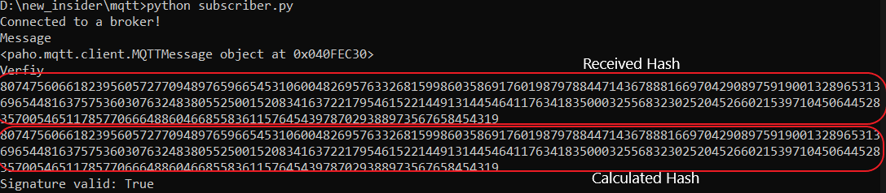

## Exercise 4: Improving the Security of MQTT once again

We aim to solve `Confidentiality` by encrypting the message using `AES-128` and `Integrity` with digital signature.
__Setting up the environment__

- We used `HBMQTT` an open-source python implemention of `MQTT`.

__Installation:__

```bash
pip install hbmqtt
```

> Make sure to have python3 and above.

- Providing `Confidentiality`  by encrypting the `publish` messages. For this, `AES-128` is used. This was chosen after comparing many other algorithms like `SPECK`, `SIMON`, `PRESENT`, but they tend to be weak with their key sizes, although they are ideal for low compuation intensive devices.

> Shared secret keys are assumed to be shared.

__Steps:__

1. Add the topic name `"Group4/verify",` to the list in `broker.py`.
2. Run the broker

```bash
$: python broker.py
```



__Publisher__

1. Read the input message from command

```python
nonce, ciphertext, tag = encrypt(input())
```

2. Encrypt the input message

```python
def encrypt(msg):
    cipher = AES.new(key, AES.MODE_EAX)
    nonce = cipher.nonce
    ciphertext, tag = cipher.encrypt_and_digest(msg.encode('ascii'))
    return nonce, ciphertext, tag
```

3. The `encrypt()` method returns `nonce`, `ciphertext`, `tag`.
    - `nonce` - for preventing replay attacks
    - `tag` -  to verify the authenticity of the message.
4. These values are sent `key-value` (`dictionary`) pairs.

```python
data = {'nonce': nonce, 'ciphertext':ciphertext, 'tag':tag }
``` 
5. Then publish the message. Make sure to convert `data` to string before sending.

```python
client.publish("Group4/test", str(myDict))
```

6. Encrypted message is published to topic `Group4/test`.




__Subscriber__

1. Subscribe to topic `Group4/test`
2. Decrypt the incoming message

> make sure to convert received message in string to dictionary class object


```python
      cipherObject = message.payload.decode() # received message in string
      cipherObject = eval(cipherObject) # Convert back to dictionary
```

3. Decrypting the message

```python
def decrypt(nonce, ciphertext, tag):
    cipher = AES.new(key, AES.MODE_EAX, nonce=nonce)
    plaintext = cipher.decrypt(ciphertext) 
    try:
        cipher.verify(tag)
        return plaintext.decode('ascii')
    except:
        return False
```

__Result__




__Integrity__

- It is no proof that connected device or data received is from actual broker. As broker does not offer any way to identify itslef.
- Most common approach to solve is using `digital signature`, where anyone can see the signed message and evrify with broker's public-key.
- To pass the digital signature, broker publishes it ona sepatrate topic 'Group4/verify'. 


__Broker__

1. Add `Group4/verify` to the list of topics.
2. Sign a message (any message or something unique to broker: This message is public)

```python
msg = b'A message for signing'
hash = int.from_bytes(sha256(msg).digest(), byteorder='big')
signature = pow(hash, d, n)
print("Signature:", hex(signature))
```

where :
- __n:__ Product of two random secret distinct large primes
- __(e,d):__ public and private key pair_

3. Publlish the signature

```python
client.publish("Group4/verify", signature)
```





__Subscriber(s)__

1. Subscribe to topic `Group4/verify`.
2. Calculate the hash for the message.

```python
    signature = message.payload.decode()
    msg = b'A message for signing' # public

    # Calculate the hash with broker's public key
    hash = int.from_bytes(sha256(msg).digest(), byteorder='big') 
    hashFromSignature = pow(int(signature), e, n)

    # Check equality
    print("Signature valid:", hash == hashFromSignature)
```
3. Compare the hash with the received hash.
4. If they are equal, connected broker is legitimate.



5. clients can  now unsubscribe to `Group4/verify` and  continue subscribing to other topics as needed.
6. In case of invalid signature. clients can simply disconnect from the connected broker.


