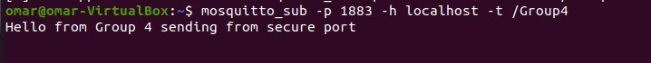
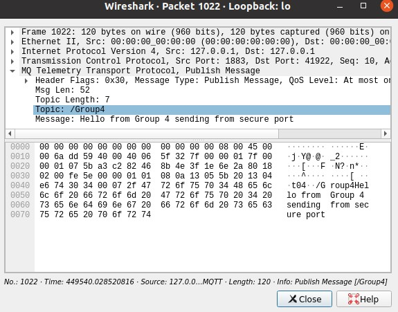
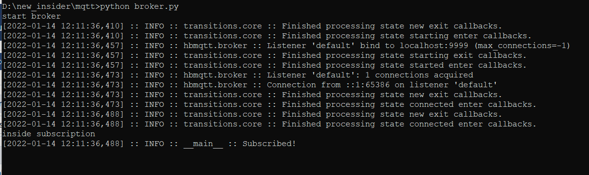
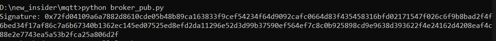
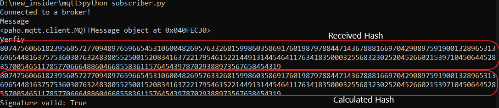

## Part 4: IoT Networks - Improving the Security of MQTT

### Exercise 1: 


__1.1 What is MQTT? Briefly describe the protocol and its purpose/relation to the IoT__

`MQTT` is a network lightweight protocol that transports messages between devices. Basically it runs over `TCP/IP` and it consists of 3 main components which are `broker`, `publisher` and `subscriber`. Clients can have one of two roles they can either `subscribe` and that means they can see any messages sent by a publisher to a specific topic or the client can be a publisher who can sent messages to all praticipants.  Broker is the communcation medium between the clients in which it depends on the topic and it sends the published messages to all subscribers.  


__1.2 Set up your own IoT Network using MQTT__
__Answer:__ 

We installed `mosquitto broker` and client on Ubuntu using the following commands below

```bash
$: sudo apt-add-repository ppa:mosquitto-dev/mosquitto-ppa
$: sudo apt-get install mosquitto
$: sudo apt-get install mosquitto-clients
```
After the installation you can check if the installation is successful as shown below


__1.3 Set up 2 MQTT Subscribers and 2 MQTT Publishers and exchange some messages via MQTT (should contain your group name as topic or payload])__
__Answer:__ 

We connected 2 publishers and send publish request as shown below to `/Group4`topic with message `"Hello from Group 4"`


Also we connected subscribers to the same topic to test the communication through the broker and we received the message that was sent by the publisher as shown in the screenshot below


__1.4 Use wireshark to inspect the sent packages and explain how the protocol works.__
__Answer:__ 

We used wireshark to inspect the `MQTT packets` and check if we can see the published message in plain text or not. We were able to filter MQTT packets through wireshark filter and we found the published message as shown below


Also when we opened the published packet we were able to see the content in plain text.


__1.5 Can you spot any vulnerabilities? If so, which security goals are violated?.__
__Answer:__ 

 Multiple vulnerabilities can be found in the basic implementation of MQTT as all text is sent in plain text which compromise the `confidentiality` of data. Also there is no proof that connected broker is authentic nor the messages it sent violating `Integrity` property.

 
### Exercise 2: 


__2.1 Enforce TLS on your MQTT Broker__
__Answer:__ 

In order to enforce `TLS` we need to generate key and certificates for CA, broker and clients. We used `OpenSSL` on Ubuntu to achieve that. First step we created a directory for CA and generated key and certificate using the command below

```bash
$ openssl req -new -x509 -days 365 -extensions v3_ca -keyout ca.key -out ca.crt
```

Now we have a certificate for CA and we need to create keys and certificates for the broker. To create the key we use the command below

```bash
$ openssl genrsa -out broker.key 2048
```

After generating the key we create a signing request from the generated key.

```bash
$ openssl req -out broker.csr -key broker.key -new
```

We can pass the csr file we created for the broker in the previous step to the validation authority

```bash
$  openssl x509 -req -in broker.csr -CA ../ca/ca.crt -CAkey ../ca/ca.key -CAcreateserial -out broker.crt -days 100
```
This will confirm if the signature is ok or not 

We will go with generating  the keys and certificates for clients also using the same steps as for the broker

```bash
$ openssl genrsa -out client.key 2048
$ openssl req -out client.csr -key client.key -new
$ openssl x509 -req -in client.csr -CA ../ca/ca.crt -CAkey ../ca/ca.key -CAcreateserial -out client.crt -days 100
```
After finishing the configuration of the keys and certificates we can have the following tree as shown in the screenshot below.


Next step is we need to modify configuration of mosquitto in order to request certificates and check them and this can be done by accessing mosquitto.conf file as shown below


The configuration recalls the `CA` and broker certificates and ask client for certificates.
We will try to publish again on topic `/Group4` and check what will happen.


We can see that we provided the `pub` and `sub` request with client keys and certificate and we received the published message without issues and after checking wireshark we found that data is encrypted so even if we intercept the publishing packet we cannot check what are the contents of the packet which fixes the problem with confidentiality.


### Exercise 3: 


__3.1 Configure your MQTT Broker such that it allows the connections via TCP as wellas via TLS (Port 1883 and Port 8883__
__Answer:__ 

We will add listener to `port:1883` to the TLS configuration so broker will be able to work on both ports at the same time to operate on the devices that are not able to support TLS also.


__3.2 Connect 2 MQTT Publishers (one via port 1883 and the other one via port 8883) and 2 MQTT Subscribers (one via port 1883 and the other one via port 8883) to the broker. All clients should publish/subscribe to the same topic. Document your observations!__

__Answer:__ 
We opened two publishers one publish on `port:8883` and the other publish on `port:1883`. At the same time we used two subscribers one on each port and all of the publishers and subscribers were on the same topic which is `/Group4`. After sending a publish request from `port:8883`, we found that we can view the messages on both subscribers as shown below although subscriber of `port:1883` has no provided certificates, so any message published can be viewed on both ports `1883`,`8883`. 




The screenshots below are from wireshark inspection which shows published message arrive on both ports and we can see it as plain text on `port:1883`.





__3.3 Assume that an attacker has access to the network and is able to connect to the MQTT Broker via port 1883 (no authentication). Is this a security issue? If so, what are the possible attacks that the attacker could execute?__
__Answer:__ 

If an attacker connects to `port:1883` this is a major security issue as it will compromise the confidentiality(as data transmission is in plaintext) of data and if the attacker can have the plain text and the ciphertext of the same message he can easily obtain the encryption key which can compromise the security of the whole network(although this is only possible in the local network).

- Since there is no authentication, attacker can create multiple connections, thus overaloading the broker and causing denial of service(DoS).


## Exercise 4: Improving the Security of MQTT once again

We aim to solve `Confidentiality` by encrypting the message using `AES-128` and `Integrity` with digital signature.
__Setting up the environment__

- We used `HBMQTT` an open-source python implemention of `MQTT`.

__Installation:__

```bash
pip install hbmqtt
```

> Make sure to have python3 and above.

- Providing `Confidentiality`  by encrypting the `publish` messages. For this, `AES-128` is used. This was chosen after comparing many other algorithms like `SPECK`, `SIMON`, `PRESENT`, but they tend to be weak with their key sizes, although they are ideal for low compuation intensive devices.

> Shared secret keys are assumed to be shared.

__Steps:__

1. Add the topic name `"Group4/verify",` to the list in `broker.py`.
2. Run the broker

```bash
$: python broker.py
```



__Publisher__

1. Read the input message from command

```python
nonce, ciphertext, tag = encrypt(input())
```

2. Encrypt the input message

```python
def encrypt(msg):
    cipher = AES.new(key, AES.MODE_EAX)
    nonce = cipher.nonce
    ciphertext, tag = cipher.encrypt_and_digest(msg.encode('ascii'))
    return nonce, ciphertext, tag
```

3. The `encrypt()` method returns `nonce`, `ciphertext`, `tag`.
    - `nonce` - for preventing replay attacks
    - `tag` -  to verify the authenticity of the message.
4. These values are sent `key-value` (`dictionary`) pairs.

```python
data = {'nonce': nonce, 'ciphertext':ciphertext, 'tag':tag }
``` 
5. Then publish the message. Make sure to convert `data` to string before sending.

```python
client.publish("Group4/test", str(myDict))
```

6. Encrypted message is published to topic `Group4/test`.


__Subscriber__

1. Subscribe to topic `Group4/test`
2. Decrypt the incoming message

> make sure to convert received message in string to dictionary class object


```python
      cipherObject = message.payload.decode() # received message in string
      cipherObject = eval(cipherObject) # Convert back to dictionary
```

3. Decrypting the message

```python
def decrypt(nonce, ciphertext, tag):
    cipher = AES.new(key, AES.MODE_EAX, nonce=nonce)
    plaintext = cipher.decrypt(ciphertext) 
    try:
        cipher.verify(tag)
        return plaintext.decode('ascii')
    except:
        return False
```

__Result__


__Integrity__

- It is no proof that connected device or data received is from actual broker. As broker does not offer any way to identify itslef.
- Most common approach to solve is using `digital signature`, where anyone can see the signed message and evrify with broker's public-key.
- To pass the digital signature, broker publishes it ona sepatrate topic 'Group4/verify'. 


__Broker__

1. Add `Group4/verify` to the list of topics.
2. Sign a message (any message or something unique to broker: This message is public)

```python
msg = b'A message for signing'
hash = int.from_bytes(sha256(msg).digest(), byteorder='big')
signature = pow(hash, d, n)
print("Signature:", hex(signature))
```

where :
- __n:__ Product of two random secret distinct large primes
- __(e,d):__ public and private key pair_

3. Publlish the signature

```python
client.publish("Group4/verify", signature)
```





__Subscriber(s)__

1. Subscribe to topic `Group4/verify`.
2. Calculate the hash for the message.

```python
    signature = message.payload.decode()
    msg = b'A message for signing' # public

    # Calculate the hash with broker's public key
    hash = int.from_bytes(sha256(msg).digest(), byteorder='big') 
    hashFromSignature = pow(int(signature), e, n)

    # Check equality
    print("Signature valid:", hash == hashFromSignature)
```
3. Compare the hash with the received hash.
4. If they are equal, connected broker is legitimate.



This ensures that broker is how he says to be.

5. clients can  now unsubscribe to `Group4/verify` and  continue subscribing to other topics as needed.
6. In case of invalid signature. clients are automatically disconnected from the broker.

__Improvement:__

- Since the publisher is running all the time  with its `digital signature` ,whether or not an active connection is established, this causes overhead on the broker.
- If no  active connections are established to the broker, it can simply stop pusblishing its signature on topic `Group4/verify`. For this, broker need to keep track of active connections.


