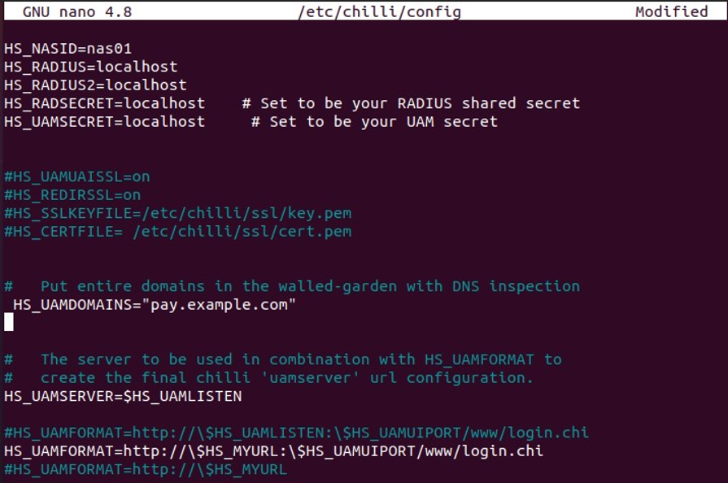

## Part 6: Real-Life Examples

### Exercise 1: Access to a Hotel WLAN

#### 1.1 Design and install a payment system which complies with the following requirements:

__Tools: Overview__
1. **Hostapd:** Access point configuration​​
2. __Bind9:__  DNS ​​
3. __Coova-Chilli:__ Access portal​
4. __Apache2:__  Webserver​​
5. __MySQL:__  Database​​
6. __Freeradius:__  Authentication server​​
7. __Daloradius:__  GUI for Radius server​


__Setup Hostapd__

1. Set adapter to `master` mode.  
```bash
sudo iwconfig  mode master
```
2. Install

```bash
sudo apt-get install hostapd
```
3. Install  `DNSMASQ` to handle DHCP and DNS on the network.

```bash
sudo apt-get install dnsmasq
```
4. Modify `/etc/network/interfaces` file to have a static IP.

```bash
auto wlan0
iface wlan0 inet static
address 10.0.0.1
netmask 255.255.255.0
```

5. Start the `hostapd`

```bash
$: sudo systemctl start hostapd
```


__Setup  DNS using bind9__

1. Installation

```bash
apt-get install bind9 bind9utils bind9-doc dnsutils -y
```

2. Edit `/etc/systemd/system/bind9.service` file to make the following changes.

```bash
[Service]
ExecStart=/usr/sbin/named -f -u bind -4
```

3. Restart `bind9`

```bash
systemctl restart bind9
```

__Configuring bind9__

4. Open `/etc/bind/named.conf.options` and uncomment/add following lines and save.

```bash
         forwarders {
                8.8.8.8;
         };
```

5. Next, define the zone for the domain, open `/etc/bind/named.conf.local`

```bash
zone "example.com" {
 type master;
 file "/etc/bind/forward.example.com";
};
```

__Configure forward lookup zone__

- Go to..
```bash
cd /etc/bind/
```
and execute  
```bash
cp db.127 forward.example.com
```
- open `/etc/bind/forward.example.com` and make the following changes


- We created another zone called `example2.com`  (`/etc/bind/forward.example2.com`)and used following to allow zone-transfers


- restart `bind9`

```bash
$: systemctl restart bind9
```

- testing using `dig` command


__Setup: FreeRadius & web GUI daloRADIUS & mysql installation__


1. install maria-db server

```bash
sudo apt install mariadb-server
```

2. Enable:

```bash
sudo systemctl enable mysql
sudo systemctl start mysql
```


__Create a Database for FreeRADIUS__


- Login as root

```bash
sudo mysql -u root -p
```

- Create DB for FreeRADIUS:

```bash
CREATE DATABASE demodb;
```


- GRANT all permission of created database to a user.

```sql
GRANT ALL ON demodb.* TO demouser@localhost IDENTIFIED BY "PASSWORD";
```


__Install  FreeRADIUS__


```bash
sudo apt-get install freeradius freeradius-mysql freeradius-utils -y
```

__Import FreeRADIUS database schema__

```bash
sudo -i 
mysql -u root -p demodb < /etc/freeradius/3.0/mods-config/sql/main/mysql/schema.sql
exit
```

__Create a symbolic link for the SQL module__


```bash
sudo ln -s /etc/freeradius/3.0/mods-available/sql /etc/freeradius/3.0/mods-enabled/
```

__Change the ownership of SQL files__

```bash
sudo chgrp -h freerad /etc/freeradius/3.0/mods-available/sql
```

```bash
sudo chown -R freerad:freerad /etc/freeradius/3.0/mods-enabled/sql
```

__Download daloRADIUS__

```bash
$ wget https://github.com/lirantal/daloradius/archive/master.zip
```

- extract and move to `www` directory

```bash
$ unzip master.zip
$ sudo mv daloradius-master /var/www/html/daloradius
```


__Import the daloRAIUS MySQL tables to the FreeRADIUS database__

```bash
cd /var/www/html/daloradius
sudo mysql -u root -p demodb< contrib/db/fr2-mysql-daloradius-and-freeradius.sql
sudo mysql -u root -p demodb< contrib/db/mysql-daloradius.sql
```


__Change permission of daloRADIUS directory__

- Rename Sample file:

```bash
cd /var/www/html/daloradius/library/
sudo mv daloradius.conf.php.sample daloradius.conf.php
```

- give permissions to user

```bash
sudo chown -R www-data:www-data /var/www/html/daloradius/
```

- Change Configuration file permission

```bash
sudo chmod 664 /var/www/html/daloradius/library/daloradius.conf.php
```

__Add Database details in the daloRADIUS configuration file__


```bash
sudo nano /var/www/html/daloradius/library/daloradius.conf.php
```

- Change the configuration values 


__Restart FreeRADIUS and Apaches services__


```bash
sudo systemctl restart freeradius
sudo systemctl restart apache2
```

- Daloradius GUI interface can now be accessed at `http://localhost/daloradius`


__Setup Coova Chilli Captive portal__


- Installing CoovaChilli

- Install its dependency `haserl`

```bash
sudo apt-get install haserl
```

```bash
$ wget https://blog.sajjan.com.np/CoovaChilli/coova-chilli_1.3.0_amd64.deb
```

```bash
sudo dpkg -i coova-chilli_1.3.0_amd64.deb
```

- Once CoovaChilli is installed, edit the configuartion file `/etc/chilli/config`





-  Start and Enable chilli

```bash
$ sudo systemctl start chilli
$ sudo systemctl enable chilli
```

- Once enabled a new interface will be created(`tun0`), this interface gets the gateway IP address for the configured hotspot.


__Captive portal:__


__Payment page__


### Exercise 2: DNS tunneling

__2.1 Prepare a demo in which you show the hotel manager how IP over DNS tunneling works in their network and prepare appropriate explanations of your demo!__

__Solution__

DNS tunneling using `dnscat2`

__Preparing the Server__

```bash
$ git clone https://github.com/iagox86/dnscat2.git
$ cd dnscat2/server/
$ gem install bundler
$ bundle install
```

> Make sure to have `ruby` installed. (Available by default in kali linux)

- Running the server


- Running the client


A session will be established and communicates using an encrypted channel.

- Verifying traffic with `wireshark`


__2.2 Develop an automated mechanism which detects DNS tunneling in a general way.Do not base this mechanism on the detection of specific host addresses, domains, or IP ranges.__

__Solution__

Detecting using `SNORT`- an open source intrusion detection system.

- write an new rule under `/etc/snort/rules`


__2.3 Propose more than one solution which can fix the DNS tunneling vulnerability.__

__Solution__

__Method 1:__

- Changing the Chilli configuration tofix DNS tunneling

- Open `/etc/chilli/config` and uncomment
```bash
HS_DNSPARANOIA​=​on
```

That line will drop DNS packets containing something other than A, CNAME, SOA, or MX records.
 
 - Usually  tunneled traffic uses `TXT`.

__Method 2:__

Install a host-based Instrusion detection system(IDS)

__Method 3__

__Throttle DNS traffic__

In Chillispot, if the user is not logged in, all the requests are redirected to captive portal page, but captive portals enforce DNS server that answers with IP even when the user is not logged in. Which is normal in most hotspots, and there is no option to disable DNS service temporarily or completely.

- TO fix this problem, we can configure the hotspot create with `hostapd`, to throttle DNS traffic (say `5 kpbs`). This does not prevent DNS tunneling but makes it nearly unusable.


### Exercise 3: DNS Security

__3.1 Demonstrate a DNS poisoning attack to divert victims from the original payment server to a fake server you set up and which is similar to the payment server.__


__Solution__


__Our Setup__


To successfully carry out DNS pouisoning we chose to do, Man-in-the-middle attack using `ettercap`


__Setting up the environment__

- Create a fake payment page and host in Apache.
- Edit the `/var/www/html/index.html` to create one.

__Configuring ettercap__

1.  open `/etc/ettercap/etter.conf` file and change to `ec_uid = 0` and `ec_gid = 0`.


2. In the same file, uncomment the Iptables commands under linux


3. Open `/etc/ettercap/etter.dns` and add the dns record that need to point.

in my case:

`pay.example.com` running on `192.168.47.128` (Fake payment page where i want the victim to redirect)


__Running the `ettercap`__


- Open ettercap

```bash
$ sudo ettercap -G
```


- Select the interface, and click on `Accept`.
- Scan for hosts

 

- Select the target and `Add to target 1` (`192.168.47.130`)


- Then load the DNS spoof plugin from the plugins menu, this will allow to poison the DNS.


__Simulating the Client__

- open the victim machine and browse  `pay.example.com`, which should redirect the user to our fake payment server.

__Result__


__3.2 Deploy DNSSec on the appropriate servers in your network and explain which security problems this solutions going to address and which problems are left open.__

__Solution:__

- For deploying we used `Webmin` to and configured our DNS server to  support `DNSSec`.

__Installing `webmin`__


```bash
$: wget http://prdownloads.sourceforge.net/webadmin/webmin_1.984_all.deb
```
```bash
$: dpkg --install webmin_1.984_all.deb
```

- Now login to webmin at the URL: `http://localhost:10000`.


- Navigate to DNS section and configure as needed.


__Setup page__


- After setup test with `dig` for DNS keys and signature


- `DNSSec` solves integrity and  authenticity by providing digital singature(Provides Data origin authenticity​), and authenticates responses to domain name lookups. However, DNSsec does not provide any kind of privacy protection for those lookups.

__Issues with DNSSec__

1. Computaional overhead.
2. Does not provide privacy
3. Chain of trust problems: had to verify/trust each and every dns server that is setup in hirarchial fashion.
4. DNSSec timing issues: Signautes(RRSIG) are not generated for every dns query, but instaed they are generated with high TTL, allowing for freshness attack.


__3.3 If there are vulnerabilities which DNSSec does not mitigate, what other mechanisms could be deployed to prevent these attacks and how would you deploy them in your setup?__

__Solution__

1. We can  use TLS(DNS over TLS). This improves privacy and security between clients and resolvers.

2. We used Nginx, this allows to create any stream into a TLS stream.

3. Install `certbot`(openssl can be used as well)


```bash
$: sudo apt install certbot
```

```bash
 # managed by Certbot
ssl_certificate /etc/letsencrypt/live/pay.example.com/fullchain.pem;
ssl_certificate_key /etc/letsencrypt/livepay.example.com/privkey.pem; 
ssl_dhparam /etc/letsencrypt/ssl-dhparams.pem; 
```

4. Edit `/etc/nginx/streams/dns-over-tls`

```bash
upstream dns-servers {
         server    127.0.0.1:53;
}

server {
    listen 853 ssl; # managed by Certbot
    ssl_certificate /etc/letsencrypt/live/pay.example.com/fullchain.pem;
    ssl_certificate_key /etc/letsencrypt/livepay.example.com/privkey.pem; 
    ssl_dhparam /etc/letsencrypt/ssl-dhparams.pem;


    ssl_protocols        TLSv1.2 TLSv1.3;
    ssl_ciphers          HIGH:!aNULL:!MD5;
        
    ssl_handshake_timeout    10s;
    ssl_session_cache        shared:SSL:20m;
    ssl_session_timeout      4h;

    proxy_pass dns-servers;

}
```

5. Activate streams.

- Edit `/etc/nignx/nginx.conf` and add the followig after `HTTP block`

```bash
stream {
        include /etc/nginx/streams/*;
}
```

6. Restart Nginx

```bash
sudo systemctl restart nginx
```

- Aftre the restart,  DoT starts server listening on the port 853.(Port can be  changed, but we used the default configuration )

> Open the TCP port 853 manually using the firewall in case of port block issue.


### Exercise 4: Secure Server Communication

__4.1 Perform a man in the middle attack using ARP poisoning and show that you can monitor network traffic. Explain your setup__

__Solution:__

To perform the MITM using `ARP poisoning` we used `arpspoof`

__Our Setup__


__step 1:__ Select the target Ip(can be obtained using `netdiscover` or `airodump-ng`)
__step 2:__ Run `arpspoof` with target IP and gateway

```bash
sudo arpspoof -i eth0  -t 192.168.47.129  192.168.47.2 
```

- `eth0` interface you want to sniff the traffic
- `192.168.47.129` - target IP(victim)
- `192.168.47.2` - Router IP

__step 3:__ Run `urlsnarf` to sniff the traffic(captures URLS only, to sniff all types of traffic , wireshark can be run)

```bash
$ sudo urlsnarf -i eth0   
```

__Step 4:__ Simulate the client (browse some non-secure sites)

__Result__


__4.2 Setup a certification authority in your network and equip the payment server with a certificate.__  
__Solution:__

__Installtion and preparing PKI__

1. Install `easy_rsa`.

```bash
$: sudo apt install easy-rsa
```

2. prepare a Public Key Infrastructure directory

```bash
$ mkdir ~/easy-rsa
```

3. Create the symlink with `ln` command

```bash
$ ln -s /usr/share/easy-rsa/* ~/easy-rsa/
```

- restric the usage to owner
```bash
$ chmod 700 /home/sammy/easy-rsa
```

4. Initialize the PKI inside `easy-rsa` directory.

```bash
$ cd ~/easy-rsa
$ ./easyrsa init-pki
```

__Creating the certificate authority__

1. create `var` file inside `easy-rsa`

```bash
$ cd ~/easy-rsa
$ leafpad vars
```

and add the following

```bash
# change to your own values
set_var EASYRSA_REQ_COUNTRY    "GE"
set_var EASYRSA_REQ_PROVINCE   "Passau"
set_var EASYRSA_REQ_CITY       "Passau"
set_var EASYRSA_REQ_ORG        "UniPassau"
set_var EASYRSA_REQ_EMAIL      "group4@outl;ook.com"
set_var EASYRSA_REQ_OU         "uniPassau"
set_var EASYRSA_ALGO           "ec"
set_var EASYRSA_DIGEST         "sha512" 
```

save and then run

```bash
$ ./easyrsa build-ca
```
-  Confirmation details are asked, `ENTER` to accept default values.

```bash
Enter New CA Key Passphrase:
Re-Enter New CA Key Passphrase:
Common Name (eg: your user, host, or server name) [Easy-RSA CA]:

CA creation complete and you may now import and sign cert requests.
Your new CA certificate file for publishing is at:
/home/kali/easy-rsa/pki/ca.crt

```

__Creating and Signing a certificate request__

1. create a directory to store the keys

```bash
$ mkdir ~/my-certificates
$ cd ~/my-certificates
$ openssl genrsa -out payment-server.key
```

```bash
openssl req -new -key payment-server.key -out payment-server.req
```
- When prompted, enter the values as above.

- Once the above step is done,  copy the `payment-server.req` file to `CA server` using `scp`

```bash
$ scp payment-server.req pay@your_ca_server_ip:/tmp/payment-server.req
```

__Setting up Apache to use SSL__


1. Open `default-ssl.conf` in apache2 config folder(`/etc/apache2/sites-enabled/000-default.conf`) and change point the certificate, keyfile and CA certificate


- Enable by running
```bash
$: sudo a2enmod ssl
```


- Restart apache

```bash
​sudo service apache2 restart 
```

__Result__


__4.3 Explain under which conditions and attacks a client may recognize a potential attack if the authentic payment server is equipped with a certificate from your CA. Again, show the different scenarios in a short demo.__

__Solution__

__Recognizable due to unknown issuer error__

- Client connects to the fake website wher certificate is installed, attacker installs the server certificate signed by attacker CA:
- This will throw a warning in browser


__Recognizable due to missing lock icon__

- Client can recognize when the site is downgraded `https` to `http`, and can notice `missing lock icon`.


__4.4 Sketch an attack scenario in which a  not-hardened CA is exploited and recognizable attacks become almost impossible to detect.__

__Solution:__ One of the possible ways is attacking the SSL in man-in-the-middle.

- While using arpspoof, we can redirect the https traffic to own server, but this time own payment server is equipped with `https`.
- When clients connects to our server, Web browser shows a warning of `Unknown identity` message. If the user ignores the warning and installs our CA certificate, we can present our fake page successfully.


- This warning sign can be bypassed if the SSL certificate is officially signed, for this technique to follow the same way. To do this, we can create a certificate for a domian that we posses. We can use services like `Let's encrypt`, then we can redirect the users to this domain.


__Technique : SSL Stripping.__


> SSL stripping may not work if the website implements  HTTP Strict Transport Security (HSTS), but can attack can be executed successfully, by installing a verfied SSL certificate on fake payment page and performing ARP poisoining. In this case, both connection use HTTPS. 


