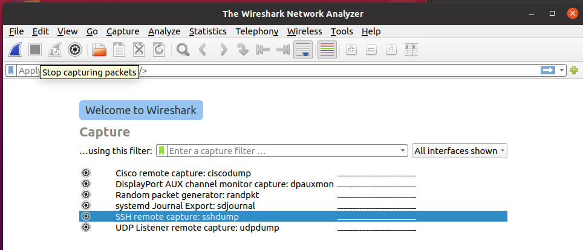
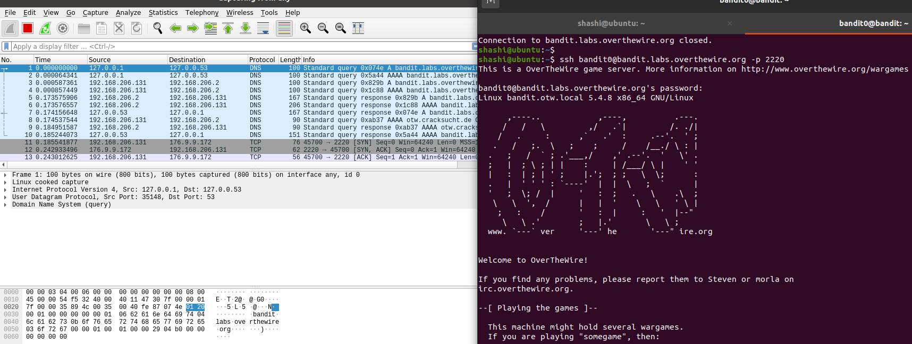
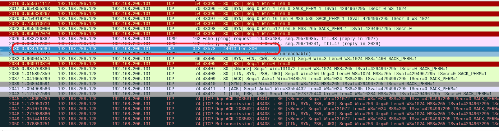
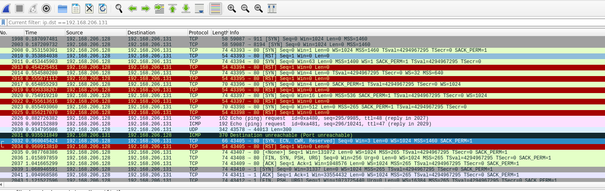
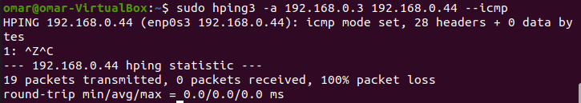
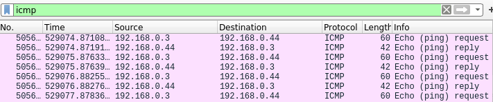

## Task Sheet 2
Authors: Omar, Shashi, Lorant

### Exercise 1: Set up a virtual network and a monitoring environment


__Installing Wireshark__

```bash
shashi@ubuntu:~$ sudo apt install wireshark
```

```bash
shashi@ubuntu:~$ wireshark --version
Wireshark 3.2.3 (Git v3.2.3 packaged as 3.2.3-1)
```

__Installing Nmap__

```bash
shashi@ubuntu:~$ sudo apt-get install nmap
```


```bash
shashi@ubuntu:~$ nmap --version
Nmap version 7.80 ( https://nmap.org )
Platform: x86_64-pc-linux-gnu
Compiled with: liblua-5.3.3 openssl-1.1.1d nmap-libssh2-1.8.2 libz-1.2.11 libpcre-8.39 libpcap-1.9.1 nmap-libdnet-1.12 ipv6
Compiled without:
Available nsock engines: epoll poll select
```

__Installing hping3__

```bash
shashi@ubuntu:~$ sudo apt install hping3
```

```bash
shashi@ubuntu:~$ hping3 --version
hping3 version 3.0.0-alpha-2 ($Id: release.h,v 1.4 2004/04/09 23:38:56 antirez Exp $)
This binary is TCL scripting capable
```


### Exercise 2: Getting to know the monitoring tools

- Launching wireshark

```bash
shashi@ubuntu:~$ wireshark &
```


- select the interface (`any`).




- able to see the network traffic 


__2.1 What is meant by ”promiscuous mode”?__

One of many network modes supported by NIC, that allows to read and intercept all network traffic. It simply snoops all the traffic that is visible on all adapaters available in the system. This mode causes the controller to pass all traffic it receives to CPU rather than sending to the controller that  should only receives the intended frames.

### Exercise 2.2:


__2.2 Even in promiscuous mode you still won’t necessarily see all packets on your LAN segment, why?__

__Solution__

If the devices is connected to a switched networked, packets are router to the intended destination and promiscous mode cannot capture in such scenario. 
- Interface may be plugged into a Token ring switch, on a switched network, where unicats traffic will not appear or other ports. 


__2.3 Can a normal, unprivileged user monitor network interfaces? Explain.__

__Solution:__

No, unprivileged user cannot monitor network interfaces unless permission where given when installing any monitoring tools that have implicit access to network interfaces.


__2.5 Write the syntax for a wireshark capture filter so that all IP datagrams with source or destination IP address equal to 10.10.10.12 are recorded.__
__Solution__

```bash
$: ip.dst == 10.10.10.12 && ip.src==10.10.10.12
```

__2.6 How can you tell if a network interface is running in "promiscuous mode" ?__

__Solution__

- Check the network adapter settings to see what mode `NIC` card is set in.

__Before turning on__

```bash
$ sudo ip link show eth0  
2: eth0: <BROADCAST,MULTICAST,UP,LOWER_UP> mtu 1500 qdisc pfifo_fast state UP mode DEFAULT group default qlen 1000
    link/ether 00:0c:29:9c:f1:2d brd ff:ff:ff:ff:ff:ff
```      

__Turning on `promisc` mode on__

```bash                 
┌──(kali㉿kali)-[~]
└─$ sudo ip link set eth0 promisc on
```                                                                                   

__Result__ (`PROMISC,UP`)

```bash                    
┌──(kali㉿kali)-[~]
└─$ sudo ip link show eth0
2: eth0: <BROADCAST,MULTICAST,PROMISC,UP,LOWER_UP> mtu 1500 qdisc pfifo_fast state UP mode DEFAULT group default qlen 1000
    link/ether 00:0c:29:9c:f1:2d brd ff:ff:ff:ff:ff:ff

```


- Spoof the packets using hping3 and analyse the wireshark capture, if wureshark captures the packets of other machines, the NIC is running in `Promiscous mode`

- Finding a remote machine NIC card mode:
    - Run nmap to determine whether the mahcines network card is set to promiscous mode. although `nmap` does;nt confirm it but results with probability.

```bash
nmap -sV --script=sniffer-detect 192.168.206.131
```

- Although from `nmap` results, we found  its highly unstable and unreliable


__2.7 Is it possible to discover ”svsuser’s” password with wireshark?__

__How would you do this?__
__Document all filters used.__
Note: you should know by now why you should never use Telnet.
On the following part you will capture and analyze network traffic.

__Solution:__

# Use the images and wireshark capture here 


Yes, it is possible to discover `svsuser`'s password as it is sent in plaintext.

- Start the wireshark capture
-  Login using `telnet`

```bash
$: telnet
svsuser
UniPassau
```

- Stop the capture
- apply the filter `telnet`
- follow the stream to view username and password at once.


__2.8 Write down the syntax for a wireshark display filter that shows packets containing HTTP messages with a destination IP address equal to your IP.__

__Solution:__

```bash
ip.dst == 192.168.206.131
```


### Exercise 3: Getting to know the scanning tools

__Analyze your own host system and your virtual machines with nmap. What information can you obtain from both?__

- Results of own host machine

```bash
$ nmap -sC -sV 127.0.01                         
Starting Nmap 7.91 ( https://nmap.org ) at 2021-11-14 15:02 EST
Nmap scan report for 127.0.01 (127.0.0.1)
Host is up (0.00012s latency).
rDNS record for 127.0.0.1: localhost
Not shown: 999 closed ports
PORT     STATE SERVICE VERSION
3306/tcp open  mysql   MySQL 5.5.5-10.5.8-MariaDB-3
| mysql-info: 
|   Protocol: 10
|   Version: 5.5.5-10.5.8-MariaDB-3
|   Thread ID: 11
|   Capabilities flags: 63486
|   Some Capabilities: Speaks41ProtocolNew, Support41Auth, LongColumnFlag, Speaks41ProtocolOld, FoundRows, SupportsCompression, ODBCClient, ConnectWithDatabase, IgnoreSigpipes, InteractiveClient, SupportsLoadDataLocal, IgnoreSpaceBeforeParenthesis, SupportsTransactions, DontAllowDatabaseTableColumn, SupportsMultipleStatments, SupportsMultipleResults, SupportsAuthPlugins
|   Status: Autocommit
|   Salt: oi@Dt>sLb*DZypGRGJ~\
|_  Auth Plugin Name: mysql_native_password

Service detection performed. Please report any incorrect results at https://nmap.org/submit/ .
Nmap done: 1 IP address (1 host up) scanned in 1.08 seconds
```

- Results of own remote virtual machine


```bash
$ nmap -sC -sV 192.168.206.131
Starting Nmap 7.91 ( https://nmap.org ) at 2021-11-14 15:21 EST
Nmap scan report for 192.168.206.131
Host is up (0.0024s latency).
Not shown: 999 closed ports
PORT   STATE SERVICE VERSION
80/tcp open  http    Apache httpd 2.4.41 ((Ubuntu))
|_http-server-header: Apache/2.4.41 (Ubuntu)
|_http-title: Apache2 Ubuntu Default Page: It works

Service detection performed. Please report any incorrect results at https://nmap.org/submit/ .
Nmap done: 1 IP address (1 host up) scanned in 7.56 seconds

```

__3.1 Are the values nmap gets the same for all different virtual linux machines?__
__Solution__

- Yes, if the virtual machines are cloned or fresh install of same version of operating systems. Although there are many factors that might result in  different values eg. server version of ubuntu might run webserver by default opening port 80 and not the case with desktop version of the same OS and version


__3.2 How does Remote OS Detection with TCP/IP Fingerprinting work? Analyze the packets nmap is sending out and receiving__

__Solution__

- Analyzing the packet responses by manipulating various flags and observing the different flags/properties one can detect the remote OS.

E.g: The `FIN probe`. Send a FIN packet (or any packet without an
    ACK or SYN flag) to an open port and wait for a response.  The
    documented  RFC, indicates to NOT respond, but some versions of OSes respond with a `RESET` packet


- Packets sent by nmap

1. `SYN` packets to all ports
2. 2 ICMP packets.
3. 1 UDP packet
 - This probe is a UDP packet sent to a closed port. The character ‘C’ (0x43) is repeated 300 times for this field If the port is actually closed and there is no firewall, Nmap expects to receive an ICMP port unreachable message in return.



4 2 ICMP Echo(IE) packets 
    - The IE test involves sending two ICMP echo request packets to the target. 

5. Sending TCP packet with `ECN`, `SYN`,  `CWR`, `Reserved` set to 1.
    - These flags are different depending upon the OS, for E.g. `ECN` (Explicit congestion Network), means that congestion occured and the other side of the link should take action/respond. If the remote system/router also supports setting or unsetting the `ECN bit`, then it responds with `ECN bit` set/unset depending upon the congestion. This usually the case with some `Windows OSes`

6. TCP packet with `FIN`, `PSH`, `URG`, `SYN` set to 1.


__3.3 How exactly does nmap determine open TCP ports?__

__Solution :__

- Send `TCP/SYN` packet to all the ports.
- If any ports respods with ``SYN/ACK`, then it completes the 3 way handshake by sending `ACK` now it can dtermine that port is open.


The implementation of the network stacks of all operating systems differ in a small amount.


__3.4 How exactly does nmap do remote OS detection?__

__Solution__



- Sends `TCP/SYN` packets to all ports
- Responded ports are probed later (in Our example `port 80` is responded)
- Probing `port 80` with various flags to determinate(guess) the OS type.
1.  `ICMP packets` - checking the response, eg: `TTL`
2. Sending TCP packet with `ECN`, `SYN`,  `CWR`, `Reserved` set to 1.
    - These flags are different depending upon the OS, for E.g. `ECN` (Explicit congestion Network), means that congestion occured and the other side of the link should take action/respond. If the remote system/router also supports setting or unsetting the `ECN bit`, then it responds with `ECN bit` set/unset depending upon the congestion. This usually the case with some `Windows OSes`
3. Sending a TCP packet with `FIN`, `PSH`, `URG` flags set to 1
    - Sending a `FIN` packet with sequence number, somes versions of windows tend to send `FIN/ACK` with a sequence number higher than the received packet.

4. Checking the window size of the packets, different OSes seem to use different window sizes.

5. `NMAP` profiles these with previously  collected responses(in its db) from different OSes and compare them with current responses, and determine the OS type.


__3.5 What is the difference (if any) between a port and a service?__  
__Solution:__ Port is an endpoint, used for communicating with a specific process or service. Whereas service (In network communcation context) is collection of endpoints, and each service creates/opens a port.


### Exercise 4: Hping3

__4.1 Briefly explain what the PING utility is used for.__


PING utility is used to check if a device or a domain is reachable and operating or not.
We used 2 VMs one of them is naive VM and another impersonating VM which will send ping requests to the naive machine but it will spoof the IP address and it will use the host machine IP address and this will be peformed using Hping3 as shown in the image below




The IP address of the host machine is 192.168.0.3 which will be used to spoof the naive machine and 192.168.0.44 is the IP address of the naive machine.

After sending the ping requests we check wireshark and we can see it can see the requests are coming from the host machine 192.168.0.3 while it is coming from  the impersonating VM 



__4.2 What command did you use to create the spoofing PING request? Explain it.__

__Solution__

```bash
$ sudo hping3 -a 192.168.0.3 192.168.0.44 --icmp 
```
The ip adress after -a is the spoofing ip adress and the second ip address is the destination address

__4.3 What happens with the ICMP packets that are sent from the NaiveVM to the Host Machine?__

__Solution__
The reply sent from the naive machine will be dropped by the host machine as the host actually didn't request them to receive an reply


### Exercise 5: Small glimpse at the Real Life Project
The network contains lot of other computers with closed ports and a computer with two open ports: SSH (port 22) and MQTT (port 1883).
This can be found with the command line tool `nmap -sn 192.168.0.*`.
Here, the attacker scans the IP range for open ports.
Since it was clear that it is a MQTT server, the developer tools had to be installed for MQTT.
The MQTT Library has to be installed first to be able to connect to the discovered MQTT server.

```bash
$ sudo apt install mosquitto-clients
$ mosquitto_sub -h 192.168.0.100 -t "/lab/#" -v
```
With the `mosquitto_sub` command, it can be connected to a MQTT server.
The current MQTT server can be discovered by subscribing to the `$sys` topic.
Most brokers implement a meta topic for information about the current broker.

Arbitary MQTT datagrams can be sent over the broker to any client with the command-line tool `mosquitto_pub`.

```bash
$ mosquitto_pub -h 192.168.0.100 -t /lab/group1 -m "hello"
```

### Exercise 5.1
Searching for vulnerabilities in a real system can be a hard and long process.
This implies the possibility of loss of information while pentesting. When steps are not documented, it can be hard for an other developer to reproduce the found vulnerability.
To prevent this, an immediate documentation of the conducted steps should be always prepared.
