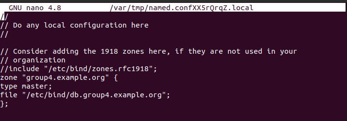

### Exercise 1: Theoretical subnetting


__1.1 Subnet the example network depicted in Figure 1 and give each network interface an IP  address (hosts, routers,firewalls, clients, servers, etc.).__


__1.2 What is the gateway address that client-hamburg needs to use if it wants to connect to a server on the Internet?__
__Answer:__ 

```bash
192.168.1.1
```
__1.3 What is the broadcast address to reach only all the hosts that are connected to the Paris’ network?__

```bash
192.168.2.255
```


### Exercise 2: Practical subnetting


- Configuration **Client-PA**

```bash
$ sudo ifconfig ens33 192.168.2.2
```

```bash
$ sudo ip route add 192.168.2.0/24 via 192.168.1.1
```

```bash
shashi@ubuntu:~$ route -n
Kernel IP routing table
Destination     Gateway         Genmask         Flags Metric Ref    Use Iface
192.168.1.0     0.0.0.0         255.255.255.0   U     0      0        0 ens33
192.168.2.0     192.168.1.1     255.255.255.0   UG    0      0        0 ens33

```


- Configuration **Server-HH**

```bash
$ sudo ifconfig ens33 192.168.1.2
```

```bash
$ sudo ip route add 192.168.1.0/24 via 192.168.1.1
```

```bash
shashi@ubuntu:~$ route -n
Kernel IP routing table
Destination     Gateway         Genmask         Flags Metric Ref    Use Iface
192.168.1.0     192.168.2.1     255.255.255.0   UG    0      0        0 ens33
192.168.2.0     0.0.0.0         255.255.255.0   U     0      0        0 ens33


```


- Configuration **Router** 


```bash
$ sudo ifconfig eth0 192.168.1.1
```

```bash
$ sudo ifconfig eth0 192.168.2.1
```

```bash
$ ifconfig 
eth0: flags=4163<UP,BROADCAST,RUNNING,MULTICAST>  mtu 1500
        inet 192.168.1.1  netmask 255.255.255.0  broadcast 192.168.1.255
        ether 00:0c:29:e4:10:53  txqueuelen 1000  (Ethernet)
        RX packets 260  bytes 81706 (79.7 KiB)
        RX errors 0  dropped 0  overruns 0  frame 0
        TX packets 30  bytes 3862 (3.7 KiB)
        TX errors 0  dropped 0 overruns 0  carrier 0  collisions 0

eth1: flags=4163<UP,BROADCAST,RUNNING,MULTICAST>  mtu 1500
        inet 192.168.2.1  netmask 255.255.255.0  broadcast 192.168.2.255
        ether 00:0c:29:e4:10:5d  txqueuelen 1000  (Ethernet)
        RX packets 234  bytes 70516 (68.8 KiB)
        RX errors 0  dropped 0  overruns 0  frame 0
        TX packets 132  bytes 20986 (20.4 KiB)
        TX errors 0  dropped 0 overruns 0  carrier 0  collisions 0
```


- Connectivity Checks

1. From server-HH send ping messages to the router and to client-PA

```bash
shashi@ubuntu:~$ ping 192.168.2.1
PING 192.168.2.1 (192.168.2.1) 56(84) bytes of data.
64 bytes from 192.168.2.1: icmp_seq=1 ttl=64 time=0.037 ms
64 bytes from 192.168.2.1: icmp_seq=2 ttl=64 time=0.067 ms
^C
--- 192.168.2.1 ping statistics ---
2 packets transmitted, 2 received, 0% packet loss, time 3064ms
rtt min/avg/max/mdev = 0.037/0.059/0.068/0.013 ms
```
2. From the router send ping messages to server-HH and to client-PA

- Router to Client-PA

```bash
shashi@ubuntu:~$ ping 192.168.2.2
┌──(kali㉿kali)-[~]
└─$ ping 192.168.2.2
PING 192.168.2.2 (192.168.2.2) 56(84) bytes of data.
64 bytes from 192.168.2.2: icmp_seq=1 ttl=64 time=0.623 ms
64 bytes from 192.168.2.2: icmp_seq=2 ttl=64 time=0.743 ms
64 bytes from 192.168.2.2: icmp_seq=3 ttl=64 time=0.776 ms
^C
--- 192.168.2.2 ping statistics ---
3 packets transmitted, 3 received, 0% packet loss, time 2027ms
rtt min/avg/max/mdev = 0.623/0.714/0.776/0.065 ms
```


- Router to Server-HH

```bash
$ ping 192.168.1.2 
PING 192.168.1.2 (192.168.1.2) 56(84) bytes of data.
64 bytes from 192.168.1.2: icmp_seq=1 ttl=64 time=1.14 ms
64 bytes from 192.168.1.2: icmp_seq=2 ttl=64 time=4.29 ms
^C
--- 192.168.1.2 ping statistics ---
2 packets transmitted, 2 received, 0% packet loss, time 1002ms
rtt min/avg/max/mdev = 1.139/2.712/4.286/1.573 ms
```

3. From client-PA send ping messages to the router and to server-HH


```bash
$ ping 192.168.1.2
PING 192.168.1.2 (192.168.1.2) 56(84) bytes of data.
64 bytes from 192.168.1.2: icmp_seq=1 ttl=64 time=1.24 ms
```

### Exercise 3: Routing and DNS

### Exercise 3: NAT

__Make sure that all the machines inside the three subnets (HAMBURG, PASSAU, MUNICH) can still reach webservers (http, https) on the Internet.__
- All machines are able to reach webservers


### 3.1 Explain

__Explain the functionality enabled by the keyword ’MASQUERADE’ in the context of the NAT configuration. Have you used it in your configuration?__

__Solution__ Masquerade NAT allows  to translate many IP addresses to one single IP address. masquerading in  NAT can be used to  hide one or more IP addresses on the  internal network. We can make use of this to expose one single IP to public and rest inside private network.
- Yes, we used it in our configuration to hide the private ip addresses of our devices to be able to access the internet as shown below. We configured on firewall south that each packet coming from client will be postrouted into interface enp0s9 which is accessible to the internet and we make each connection coming from the subnet ESTABLISHED and RELATED for stable communication


```bash

iptables -t nat -A POSTROUTING -s 192.168.3.0/24 -o enp0s9 -j MASQUERADE
```
```bash
iptables -A FORWARD -s 192.168.3.0/24 -o enp0s9 -j ACCEPT
```
```bash
iptables -A FORWARD -m state --state ESTABLISHED,RELATED -i enp0s9 -j ACCEPT
```


After configuring 5 VMs for the the 3 subnets and 2 firewalls we configured a DNS server on server-HH. We installed bind9 to confiure DNS. We created db.group4.example.org file to configure the dns and define the clients name with the relating IP address as shown below.


After that we configured named.conf.options and named.conf.local files in order to provide the zone, forwarders and trusted access list




The final step to configure the DNS is from the client side and this can be done by adjusting `/etc/reslov.conf` file on the client or adjusting the DNS configuration manually to server-HH IP address and the screenshot below shows we were able to ping using the hostnames from DNS server.


We tried to connect through ssh from client-PA into server-HH and it worked after installing the SSH connection.


### Exercise 4: Firewalling


__4.1 Set the firewalls to deny all connections by default.__  
__Solution__


- In our setup following  policies are setup on both firewalls.

```bash
iptables -P INPUT DROP   # Drop all incoming packets
```
```bash
iptables -P OUTPUT DROP   # Drop all outgoing packets
```
```bash
iptables -P FORWARD DROP   # Disable forwarding
```


__4.2 Prohibit machines on the internal network to provide services to the outside (e.g. an Internet reachable webserver on client-PA shall be prohibited), but allow all machines to use any service on any machine (internal subnets & Internet) as long as they initiate the connection__

__Solution__ Access to the internet is blocked by default

__1. Explain the differences between dynamic and static packet filtering. You should have used a dynamic filtering rule in the exercise above, state which and explain how it works.__
__Solution:__ 
- Static filtering :  In static filtering, firewall rule decises which packets are allowed or denied. Firewall evaluates each packet independently and has no impact with previous packets that have passed or denied.
- Dynamic filtering:  In dynamic filtering  firewall, it reacts to an event and create or update rules to handle with that particular event. It filters traffic with particular connection states, usually filtered by IP and PORT. For eg: Opening an FTP to outside world, PORT 21 must be left open permanently open so that outside clients can attempt establishing connection.
    - Dynamic filtering allows  port 21 to be opened at the start of an FTP session and then closes at the end of the session.


__2. Explain in what form dynamic filtering is better than static filtering?__

__Solution:__ The advantage of dynamic filtering is stateful packet inspection.  These stateful packet inspection filters the  exchange of packets, effectively by opening ports in the firewall for each communications session when needed basis, and then close the port as soon as they're no longer needed. One can easily allow or block the traffic accordingly.
- With this option one can switch events to inspect packets, which is useful in assisting security problems.

__4.3 Tell the firewall FW-south to REJECT all icmp requests from the PA Subnet and the Lab’s network. Test this by trying to ping from client-PA, but also try if the reverse succeeds (e.g. it shall still be possible to ping the computer client-PA from server-HH).__

__Solution__

```bash
iptables -A FORWARD -s 192.168.3.3/24 -p ICMP --icmp-type 8 -j REJECT
```
Below you can find client-PA cannot ping server-HH after appling the rule while server-HH can ping client-PA normally


__4.4 Remove the ability to ping the firewalls themselves. This means you must tell the firewall to REJECT all icmp requests addressed to the FW-north and FW-south.__


- Firewall North & Firewall south

```bash
Iptables -A INPUT -p ICMP --icmp-type 0 -j DROP
Iptables -A OUTPUT -p ICMP --icmp-type 8 -j DROP
```


__4.5 SSH sessions are only allowed to server-HH, all other ssh connections (despite of their destination or origin) shall be blocked.__

__Solution__

- Tell the firewall(s) to forward all `SSH` connections to `server-HH`

__North && South__

```bash
sudo iptables -A FORWARD -p tcp -d 192.168.1.3 --dport 22 -m state --state
NEW,ESTABLISHED -j ACCEPT
```

```bash
sudo iptables -A FORWARD -p tcp -s 192.168.1.3 -d --sport 22 -m state --state
ESTABLISHED -j ACCEPT
```
- Reject for all others

```bash
sudo iptables -A FORWARD -p tcp --sport 22 -j REJECT
```

__4.6 Make sure that the FW facing the Internet (Lab’s Net) prohibits that IP packets with a source address of the internal subnets arrive on the external interface (i.e. eth0 on FW-south).__

__Solution__

- On south firewall

```bash
sudo iptables -A OUTPUT -o eth0 -s 192.168.3.1/24 -j REJECT
sudo iptables -A OUTPUT -o eth0 -s 192.168.2.1/24 -j REJECT
sudo iptables -A OUTPUT -o eth0 -s 192.168.1.1/24 -j REJECT
```

__1. What is the reason to have FW rules that prohibit IP packets with a source address inside the internal subnet to leave to the external interface?__

- The above rule will block all connection to internet with source from internal subnet addresses. Firewall on the south uses `NAT` and connected to internet, hence internal network need not be exposed to connect to internet.In such case of accessing internet, the south firewall need to route  route the packets when trying to access the external network. 


### Exercise 5: Firewalling continued

__5.1 Give the iptables commands / rules that allow users on subnet PASSAU to view web pages (http, https) on a web server running in subnet HAMBURG (start/install web-server on server-HH). The rules shall block access to this server from the MUNICH subnet.__


__Solution__

1. Installing `Nginx` server (server-HH - 192.168.1.3 ).

```bash
$: sudo apt install nginx
```

- Passau subnet (`192.168.3.1/24`)

 **On North & South firewall**

```bash
sudo iptables -A FORWARD -p tcp -s 192.168.3.1/24 -d 192.168.1.1/24 -m multiport --dports 80,443 -m conntrack --ctstate NEW,ESTABLISHED -j ACCEPT
```

- Block from munich subnet

**North firewall**

```bash
sudo iptables -A FORWARD -p tcp -s 192.168.2.1/24 -d 192.168.1.1/24 -m multiport --dports 80,443 -m conntrack --ctstate NEW,ESTABLISHED -j REJECT
```

- `-m conntrack`: allow the match based on connection state
- `--cstate`: parameter to define the list of states(like `new`, `established`, `closed`)


__5.2 Write the iptables commands / rules to allow HTTP and HTTPS traffic from the Internet (Lab’s Net) into the HAMBURG subnet. This includes access to a web server on server-HH.__


```bash
sudo iptables -A FORWARD -i eth0 -p tcp -d 192.168.1.0/24 -m multiport --dports 80,443 -m conntrack --ctstate NEW,ESTABLISHED -j ACCEPT
sudo iptables -A FORWARD -o eth1 -p tcp -s 192.168.1.0/24 -m multiport --dports 80,443 -m conntrack --ctstate ESTABLISHED -j ACCEPT
```


__5.3 Do not allow nor route any packets that try to use any host other than server-HH as their DNS nameserver. The DNS server port is 53. DNS can use both the tcp and udp protocols (udp by default).__


On both firewalls:
- Allow DNS (53) from server-HH - 192.168.1.3

```bash
iptables -A INPUT -p udp --dport 53 -s 192.168.1.3 -j ACCEPT
iptables -A INPUT -p tcp --dport 53 -s 192.168.1.3 -j ACCEPT
```
- Deny all other DNS requests

```bash
iptables -A INPUT -p udp --dport 53 -j DROP
iptables -A INPUT -p tcp --dport 53 -j DROP
```


__5.4 Can you still browse the internet? Explain why / why not. You still want all machines (in all three subnets) to browse the World wide Web (http/https). There are, roughly speaking, ways to accomplish this in regard to DNS resolution.__

__Solution__ No, we are unable to browse the internet, although connection to external IP addresses is still possible. This simply means that domain names can not be resolved.


We can use:
- To set in `Server-HH` one of Google’s DNS Server 8.8.8.8 as additional forwarder. The server is then forwarding DNS queries to a external server


__5.5 Log all traffic that attempts to connect to server-HH__
__Solution__

```bash
iptables -A FORWARD -m state --state NEW -d 192.168.1.3 -j LOG --log-prefix "New HH Connection: "
```

- log files can be viewed in

```bash
$: cat /var/log/syslog
```


### Exercise 6: -EXTRA-CREDITS- DNS in more detail

__6.1 Explain the concept of DNS zones. Explain the difference between a ’managed’ and a ’delegated’ zone.__
__Solution:__ 
1. DNS zone is portion of DNS name space, which contains DNS records.
2. Allowing zones, makes it easy to handle DNS records for adminitartive reasons and for redundancy.
3. Zones allow more fine grained granular control over the DNS records and components.
4. A DNS zone can also contains multiple subdomains and zones may also co-exist on same physical server.


__Managed zones:__ Set or container of all DNS records that has same DNS prefix. Eg: `example.de`.

__Delegated zones:__ Delegation allows an organization to assign control of a subdomain to another organization. The parent now has pointers to the original sources of data in the subdomain. Delegated zones are zones  delegated or managed by another name server who has authority over that zone.


__6.2 Explain shortly (no more than 10 sentences) how the Internet’s DNS system is set up (e.g. root servers, zones, registrars ...).__
__Solution__

1.  Whenever a DNS request is sent, is usually handled by the  DNS server to map IP address,  which is in many most cases internet service provider(ISP).
2. This DNS server also called `Recursive DNS resolver`.
3. DNS resolver checks its cache for corresponding domain, if unavilable, it request `Root DNS server`.
4. The Root DNS resolver responds with one of TLD name server(Top lovel domain) server. For Eg: www.example.com  has `.com` TLD name server (`.com NS`).

5. `.com NS` responds  to follow up with responsible authoritative name server(Which is `ns1.exmaple.com`).
6. Then DNS resolver request the authoritative name server to obtain the IP address.


- Reverse DNS look up: Maps IP addresses to domain names. It allows to track the origin of the website.


__6.3 Explain the concept of DNS forwarding? Are there any security gains when DNS forwarding is used? Is there any additional filtering that would be possible (give an example)?__

- DNS forwarding allows DNS queries to be handled by seperate designated server rather than the server that has been contacted initially.

- DNS forwarders sinmply forward from one server to another server, rather than addressing the query.

- DNS server are configured to forward request(Most cases) for all the addresses that are not within the network to a dedicated server/forwarder. FOr Eg: forwarding a request to `8.8.8.8` or trusted DNS, when an internal IP is trying connect to external domain.


**Security Gains:**
- If requests are forwarded to known servers, and not to local Internet Service Provider (ISP). Benefits are increased performance and security from phishing, malware, botnets, and targeted online attacks. As the resolve process is trusted, clients can be sure of not being tricked with fake domains.


# Need to edit following


__6.4 Explain in detail what a zone transfer is? Why is it needed? What is the difference between a zone transfer and a zone replication?__


__Solution__

- DNS zoine transfer is the process of copying/transfering DNS records from oner server to another, usually from primary DNS to secondary DNS server.

- Zone transfer uses Transcation based TCP protocol.Takes form from client to server.

- Zone transfer is needed either for creating a backup server or for redundancy, where the redundant server acts as secondary DNS server.


**Differences**

Zone transfer can be a full transfer or incremental transfer but zone replication allows to specify records to copy/replicate. Zone replication allows you to be able to decide the conditions or parameters for replicating the DNS zone.


__6.5 What is the concept/idea behind ’Incremental zone transfers’ ? What is the gain? Are they widely used in today’s DNS system?__

__Solution:__

- Incremental Zone Transfer: Incremental zone transfers, the secondary DNS server retrieves only resource records that have been modified or changed within a zone, so that it remains synchronized with the primary DNS server.

- When incremental transfers are used, the databases on the primary server and the secondary server are compared against each other to check differences.
- If the zone records are identified as original (based on the serial number of the Start of Authority resource record), no zone transfer is performed. If not  a transfer of the delta resource records commences (A serial number sequence is checked to see if the transfer has occured or not).
- Because of this transfer method, it requires  less bandwidth and create less network traffic, making  them to copy DNS records faster.

 
- Yes, Incremental zone transfers are widely used and they are efficient ways to copy records from primary to secondary DNS server.


__6.6 Can you think of any malicious attacks? Give some details how you would carry out such attacks.__
__Solution:__


__6.7 What are the general options to secure DNS transfers? How do they roughly work?__

- Some of the common ways attacks in DNS transfers happen in DNS zone transfers.

__Impact of DNS Zone Transfer Vulnerability__

- Zone transfer can be done withotut any form of authentication, as any client can request for copy of DNS records of the entire zone and server can send without verifying the client.

- Unless some protection mechanism is used, anyone will be able to get all the records for that particular domain, which gives the potential attacker to obtain network information and map to find various potential targets.


__Preventing DNS Zone Transfer Vulnerability?__

- Allowing zone trabnsfers from trusted clients
-  The following is an example of how to fix this in the BIND DNS server.

- Navigate to `/etc/named.conf` and add these: 

```bash
    ACL trusted-servers 
        {  
            192.168.2.2; // ns1  
            192.168.1.2; // ns2  
        };
        zone example.com 
        {  
            type master;   file "zones/zonetransfer.me"; 
            allow-transfer { trusted-servers; };  
        };
```


- Some of the DNS servers ask for HMAC(Message authentication codes) when requesting zone transfers. Servers can identify the legitimate clients by verifying the HMACs sent by the client.


